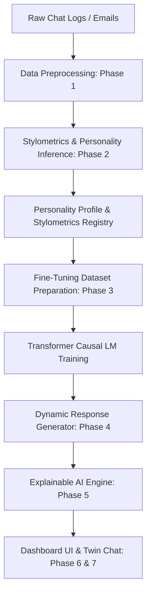
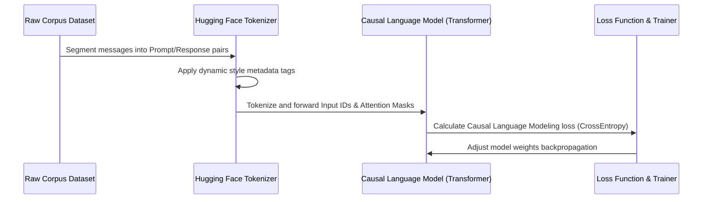

# Digital Personality Twin (DPT)

A complete end-to-end generative AI system that models a target individual's communication dynamics, emotional tendencies, stylometric habits, and unique vocabulary to generate a highly authentic digital twin.

---

## 🚀 Key Distinction: Chatbot vs. Digital Personality Twin

| Feature | Standard Chatbot | Digital Personality Twin (DPT) |
| :--- | :--- | :--- |
| **Objective** | Extract data or answer queries objectively. | Emulate a specific target individual's character, style, and tone. |
| **Stylometric Core** | Clean, homogeneous formatting (standard assistant tone). | Captures idiosyncratic punctuation, slang, emojis, and sentence lengths. |
| **Personality Base** | Uniformly neutral, polite, and factual. | Modeled around the target's Big Five personality distribution. |
| **Attribution & XAI** | Opaque prompt context summaries. | Exact training-token correlation percentages and stylistic weight calculations. |

---

## 🛠️ Complete System Architecture



---

## 🧠 Deep Learning Training Flow



---

## 💻 Technical Module Walkthrough

### Phase 1: Data Collection & Preprocessing
- **Objective**: Load raw, unstructured textual data and clean out noise while keeping key stylistic attributes.
- **Key Concepts**: Slang translation, regex extraction, tokenization, POS tagging.
- **Why Data Cleaning is Crucial**: Raw user logs are loaded with platform markers, system lines (e.g. *"joined the group"*), and hyper-abbreviated slang. Unclean inputs contaminate the model's word distribution. By normalising slang while extracting emojis and structural style parameters to an active metadata profile, we keep the core grammar healthy without losing stylistic personality.

### Phase 2: Personality & Stylometrics Extraction
- **Objective**: Calculate writing signatures and emotional traits.
- **Key Concepts**: Stylometrics, Big Five trait mapping (O.C.E.A.N), VADER sentiment analytics.
- **Linguistic Mappings**: We count averages of sentence lengths, punctuation counts, and common emojis to derive a stylometrics registry, mapping these to psychological dimensions.

### Phase 3: Model Fine-Tuning
- **Objective**: Alter token probability distributions to emulate target responses.
- **Key Concepts**: Causal language modeling, causal masking, backpropagation.
- **Hugging Face integration**: Dataset pairs are mapped to dynamic prompts containing stylometric parameters, training the neural network using `TrainingArguments` configurations.

### Phase 4: Generative Stylistic Transfer
- **Objective**: Stylized output generation.
- **Key Concepts**: Causal text sampling, temperature, top-p, prompt injection.

### Phase 5: Explainable AI (XAI)
- **Objective**: Uncover what text parameters caused a response.
- **Key Concepts**: Token attribution mapping, structural similarity scoring.

---

## 🏃 Deployment & Running Steps

Ensure you are using the active workspace at `C:\Users\jsomy\.gemini\antigravity\scratch\digital_personality_twin`.

### 1. Install Dependencies
```bash
pip install fastapi uvicorn spacy nltk emoji pandas pydantic torch transformers
python -m spacy download en_core_web_sm
```

### 2. Launch FastAPI Backend Service
```bash
# From project directory
python src/backend/main.py
```
The server will boot up locally at `http://127.0.0.1:8000`.

### 3. Open the Frontend Interface
Simply open `src/frontend/index.html` directly in a browser. It connects automatically to your running FastAPI backend and loads the dynamic dashboard panels.
